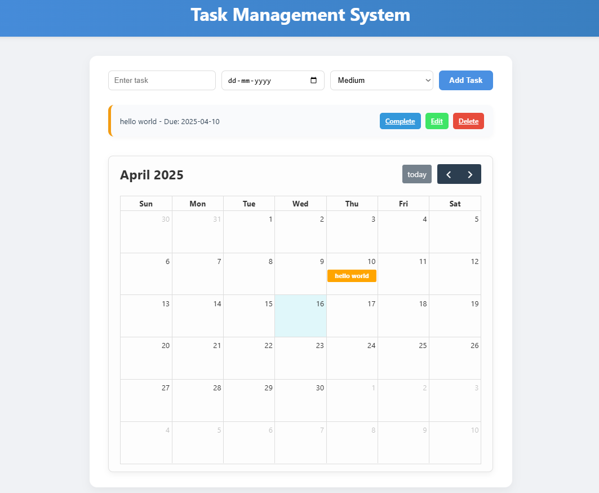

# Task Manager (Flask-based)

A simple yet powerful Task Management System built using Flask. Users can add, complete, edit, delete tasks, and visualize deadlines using an interactive calendar (FullCalendar). Tasks are saved in a JSON file for persistence.

## Screenshot

## Features

- Add, Edit, Delete Tasks
- Set Deadlines and Priorities (Low, Medium, High)
- Toggle Completion Status (Complete/Undo)
- Visual Calendar View of Tasks using FullCalendar
- Data saved in data.json (no database required)

## Tech Stack

- **Backend:** Python, Flask
- **Frontend:** HTML, CSS, JavaScript
- **Calendar:** FullCalendar (via CDN)
- **Storage:** JSON file-based persistence
